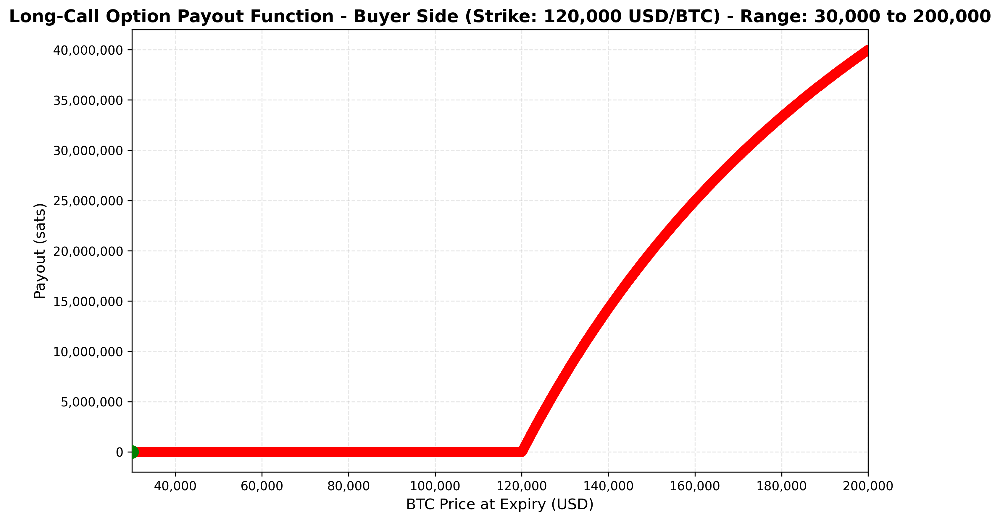
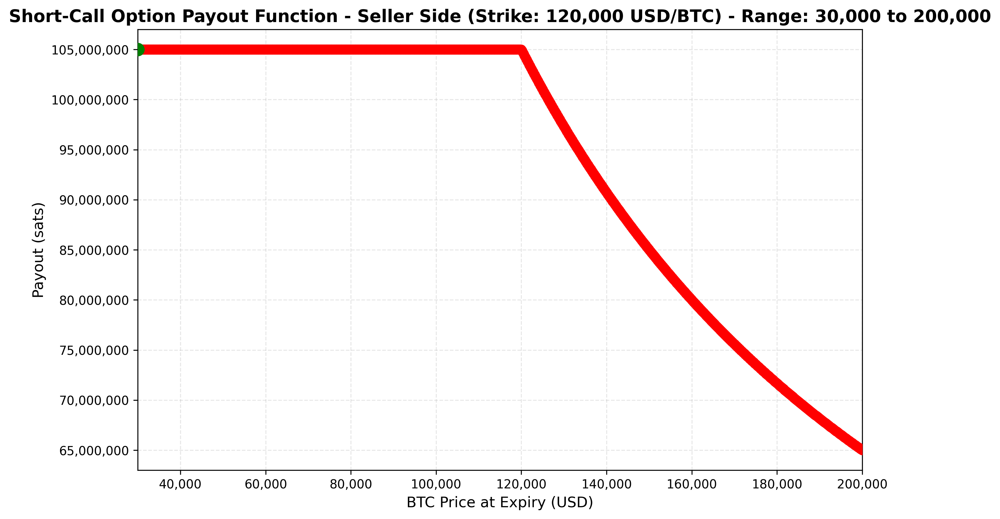
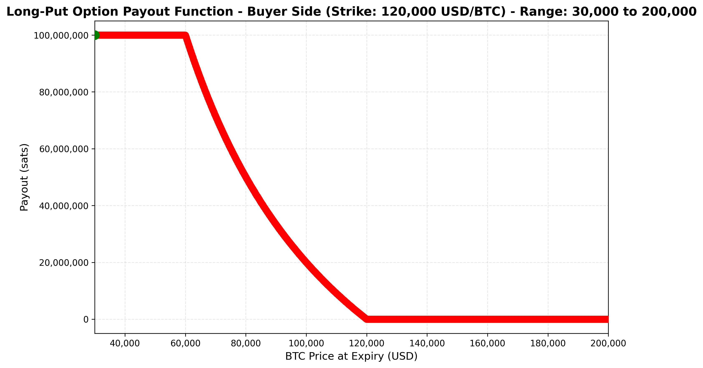
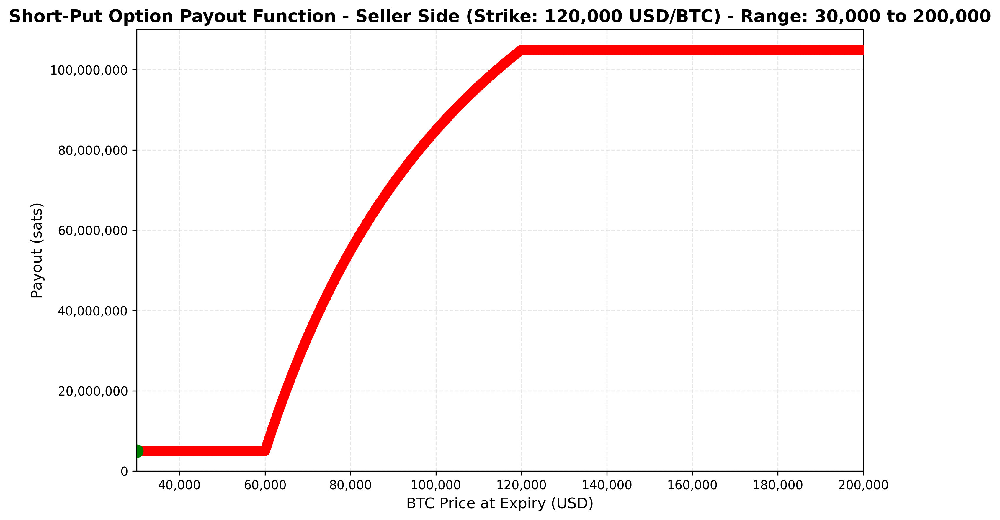

# Payout Function Samples

This document describes four examples of payout functions for option-style DLCs: CALL and PUT options for both buyer (LONG) and seller (SHORT) positions.

## Common Parameters

All payout functions in this document use the following common parameters:

- `strike` = strike price of the option (BTCUSD price).
- `premium` = price in satoshis paid by the buyer to the seller of the option (e.g., BTC).
- `price_at_expiry` = price of the option at expiry (BTCUSD price).
- `num_contracts` = number of contracts agreed in this option.
- `col` = collateral_per_contract, that is, how many satoshis correspond to one contract. This is provided by the seller of the option.
- `sats_per_btc` = number of satoshis per bitcoin (100.000.000)

**Considerations:**   
- The payout is in sats, not in BTC. This means that the proper units must be used along the construction of the formula using the `sats_per_btc` value.

- The payout is built to be a non-negative outcome for both parties. The typical option's contract payout can be negative when looked as *how much did I lose* relative from what I entered the contract with. However, in the DLC arrangement, payouts must always be a non-negative outcome. To build a DLC option's contract, the funding transaction serves as a 'pool' of funds from which payouts are sent, meaning that both parties get either zero or a positive amount. The formulas need to be built accordingly.  
For example, if the price at expiry is below the strike price, the seller of a call option gets:
  - In a typical options contract: `premium * num_contracts`.
  - In the DLC arrangement:  `(premium + col) * num_contracts`.

- As described in this document, the `premium` owed to the seller is considered part of the payout at the *end* of the contract, that is, once it is settled. For a real life implementation, one may want to separate the premium to be paid upfront, for example, as an additional output to the seller in the funding transaction (and later setting to zero the `premium` variable in these formulas).

**`upper_cap` for CALL options**

The `upper_cap` is the outcome value (x coordinate) in which the buyer gets the maximum payout (`num_contracts * col`). In other words:

`num_contracts * col = num_contracts * (((upper_cap - strike) / upper_cap) * sats_per_btc)`

Solving for `upper_cap` we get:

`upper_cap = sats_per_btc * strike / (sats_per_btc - col)`

Observe that when `sats_per_btc <= col`:
- If equal: denominator is zero (division by zero), cap is at infinity.
- If collateral > sats_per_btc: denominator is negative, resulting in negative cap (invalid).

In both cases, the cap doesn't exist as a finite value. Hence, we use `max_u64` as the practical cap if `sats_per_btc <= col`.

**`lower_cap` for PUT options**

The `lower_cap` is the outcome value (x coordinate) in which the buyer of the PUT option gets the maximum payout (`num_contracts * col`). In other words:

`num_contracts * col = num_contracts * (((strike - lower_cap) / lower_cap) * sats_per_btc)`

Solving for `lower_cap` we get:

`lower_cap = sats_per_btc * strike / (sats_per_btc + col)`

Observe that the `lower_cap` is always greater than zero. 

## Example 1: LONG CALL Payout (Buyer Side)

A LONG CALL option gives the buyer the right to buy at the strike price. The payout function is constructed with 4 endpoints (0, strike, upper_cap, max_u64) and 3 pieces.

*Figure 1: LONG CALL option payout curve showing the buyer's payout as a function of the price at expiry. Parameters: `strike` = 120,000 USD, `num_contracts` = 1, `col` = 100,000,000 sats (1BTC), `premium` = 5,000,000 sats. The `upper_cap` is at infinity, so we need to approximate with `upper_cap` = 2^64 -1 (max value of u64).*

### Payout Behavior

- **Price at expiry is EQUAL or LESS than the strike price:**
  - Buyer gets: `0`

- **Price at expiry is GREATER than the strike and LESS than the upper cap:**
  - Buyer gets: `num_contracts * (((price_at_expiry - strike) / price_at_expiry) * sats_per_btc)`

- **Price at expiry is EQUAL or GREATER than the upper cap:**
  - Buyer gets: `num_contracts * col`

### Piecewise Function Definition

**Piece 0: PolynomialCurvePiece from 0 to strike**
- At 0: `0`
- At strike: `0`

**Piece 1: HyperbolaCurvePiece from strike to upper_cap**
- Formula: `num_contracts * (((price_at_expiry - strike) / price_at_expiry) * sats_per_btc)`
- Parameters:
  - `f_1`: `0`
  - `f_2`: `num_contracts * sats_per_btc`
  - `a`: `1`
  - `b`: `0`
  - `c`: `0`
  - `d`: `- num_contracts * strike * sats_per_btc`
  - `use_positive_piece`: `True`

**Piece 2: PolynomialCurvePiece from upper_cap to max_u64**
- At upper_cap: `num_contracts * col`
- At max_u64: `num_contracts * col`

## Example 2: SHORT CALL Payout (Seller Side)

A SHORT CALL option obligates the seller to sell at the strike price if exercised. The payout function is constructed with 4 endpoints (0, strike, upper_cap, max_u64) and 3 pieces.

*Figure 2: SHORT CALL option payout curve showing the seller's payout as a function of the price at expiry. Parameters: `strike` = 120,000 USD, `num_contracts` = 1, `col` = 100,000,000 sats (1BTC), `premium` = 5,000,000 sats. The `upper_cap` is at infinity, so we need to approximate with `upper_cap` = 2^64 -1 (max value of u64).*

### Payout Behavior

- **Price at expiry is EQUAL or LESS than the strike price:**
  - Seller gets: `num_contracts * (premium + col)`

- **Price at expiry is GREATER than the strike and LESS than the upper cap:**
  - Seller gets: `num_contracts * (premium + col - (((price_at_expiry - strike) / price_at_expiry) * sats_per_btc))`

- **Price at expiry is EQUAL or GREATER than the upper cap:**
  - Seller gets: `num_contracts * premium`

### Piecewise Function Definition

**Piece 0: PolynomialCurvePiece from 0 to strike**
- At 0: `num_contracts * (premium + col)`
- At strike: `num_contracts * (premium + col)`

**Piece 1: HyperbolaCurvePiece from strike to upper_cap**
- Formula: `num_contracts * (premium + col - (((price_at_expiry - strike) / price_at_expiry) * sats_per_btc))`
- Parameters:
  - `f_1`: `0`
  - `f_2`: `num_contracts * (premium + col - sats_per_btc)`
  - `a`: `1`
  - `b`: `0`
  - `c`: `0`
  - `d`: `num_contracts * strike * sats_per_btc`
  - `use_positive_piece`: `True`

**Piece 2: PolynomialCurvePiece from upper_cap to max_u64**
- At upper_cap: `num_contracts * premium`
- At max_u64: `num_contracts * premium`

## Example 3: LONG PUT Payout (Buyer Side)

A LONG PUT option gives the buyer the right to sell at the strike price. The payout function is constructed with 4 endpoints (0, lower_cap, strike, max_u64) and 3 pieces.

*Figure 3: LONG PUT option payout curve showing the buyer's payout as a function of the price at expiry. Parameters: `strike` = 120,000 USD, `num_contracts` = 1, `col` = 100,000,000 sats (1BTC), `premium` = 5,000,000 sats. The `lower_cap` is calculated as `lower_cap` = `sats_per_btc` * `strike` / (`sats_per_btc` + `col`), which places it at `lower_cap` = 60,000 USD.*

### Payout Behavior

- **Price at expiry is EQUAL or LESS than the lower cap:**
  - Buyer gets: `num_contracts * col`

- **Price at expiry is GREATER than the lower cap and LESS than the strike:**
  - Buyer gets: `num_contracts * (((strike - price_at_expiry) / price_at_expiry) * sats_per_btc)`

- **Price at expiry is EQUAL or GREATER than the strike price:**
  - Buyer gets: `0`

### Piecewise Function Definition

**Piece 0: PolynomialCurvePiece from 0 to lower_cap**
- At 0: `num_contracts * col`
- At lower_cap: `num_contracts * col`

**Piece 1: HyperbolaCurvePiece from lower_cap to strike**
- Formula: `num_contracts * (((strike - price_at_expiry) / price_at_expiry) * sats_per_btc)`
- Parameters:
  - `f_1`: `0`
  - `f_2`: `- num_contracts * sats_per_btc`
  - `a`: `1`
  - `b`: `0`
  - `c`: `0`
  - `d`: `num_contracts * strike * sats_per_btc`
  - `use_positive_piece`: `True`

**Piece 2: PolynomialCurvePiece from strike to max_u64**
- At strike: `0`
- At max_u64: `0`

## Example 4: SHORT PUT Payout (Seller Side)

A SHORT PUT option obligates the seller to buy at the strike price if exercised. The payout function is constructed with 4 endpoints (0, lower_cap, strike, max_u64) and 3 pieces.

*Figure 4: SHORT PUT option payout curve showing the seller's payout as a function of the price at expiry. Parameters: `strike` = 120,000 USD, `num_contracts` = 1, `col` = 100,000,000 sats (1BTC), `premium` = 5,000,000 sats.  The `lower_cap` is calculated as `lower_cap` = `sats_per_btc` * `strike` / (`sats_per_btc` + `col`), which places it at `lower_cap` = 60,000 USD.*

### Payout Behavior

- **Price at expiry is EQUAL or LESS than the lower cap:**
  - Seller gets: `num_contracts * premium`

- **Price at expiry is GREATER than the lower cap and LESS than the strike:**
  - Seller gets: `num_contracts * (premium + col - (((strike - price_at_expiry) / price_at_expiry) * sats_per_btc))`

- **Price at expiry is EQUAL or GREATER than the strike price:**
  - Seller gets: `num_contracts * (premium + col)`

### Piecewise Function Definition

**Piece 0: PolynomialCurvePiece from 0 to lower_cap**
- At 0: `num_contracts * premium`
- At lower_cap: `num_contracts * premium`

**Piece 1: HyperbolaCurvePiece from lower_cap to strike**
- Formula: `num_contracts * (premium + col - (((strike - price_at_expiry) / price_at_expiry) * sats_per_btc))`
- Parameters:
  - `f_1`: `0`
  - `f_2`: `num_contracts * (premium + col + sats_per_btc)`
  - `a`: `1`
  - `b`: `0`
  - `c`: `0`
  - `d`: `- num_contracts * strike * sats_per_btc`
  - `use_positive_piece`: `True`

**Piece 2: PolynomialCurvePiece from strike to max_u64**
- At strike: `num_contracts * (premium + col)`
- At max_u64: `num_contracts * (premium + col)`

